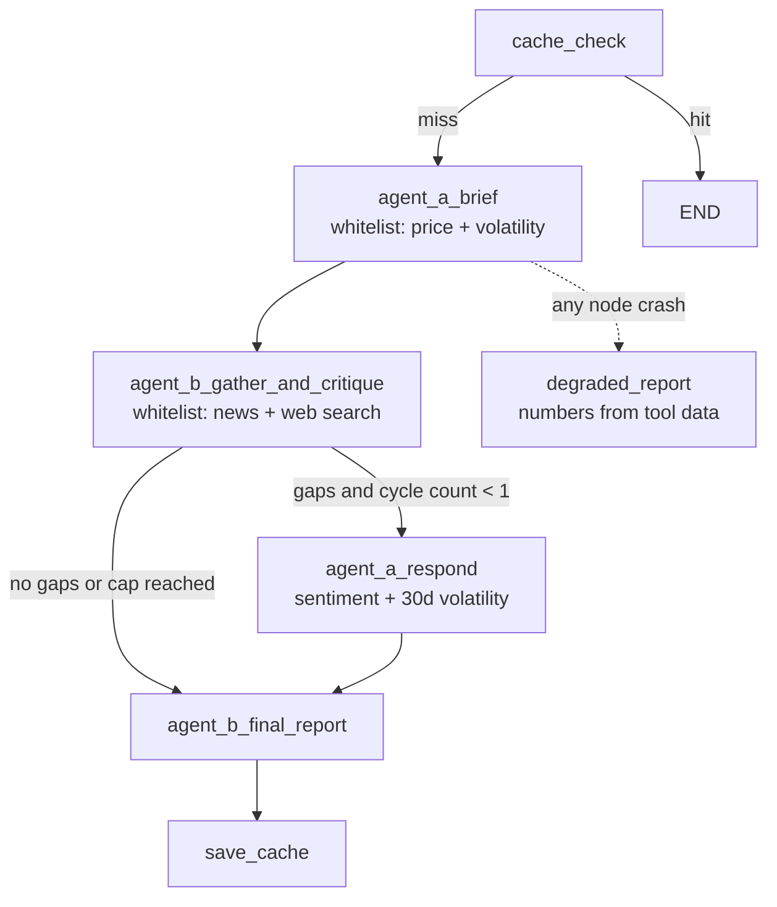

# Agentic Financial Research System

Two agents with restricted tool sets autonomously research a ticker through a
typed state machine, critique each other's gaps, and produce a validated
three-risk report whose **numbers are computed in Python** (the LLM writes
prose, never arithmetic). Built per `docs/plan_task3_agentic.md`.

## Architecture



Key properties:

- **JSON-action ReAct loop**: each agent returns `{thought, action, args,
  replan_reason}`; the loop is plain Python (no fixed tool order anywhere, so
  the same protocol runs a different choreography per run).
- **Runtime whitelists** (`config.WHITELISTS`): agent A cannot touch news or
  web search; agent B cannot touch price data, volatility or the sentiment
  tool. Violations are refused inside the dispatcher and shown in the trace.
- **Guards with evidence**: per-role step caps (8 single / 6 per role), a
  duplicate-call refusal after warnings, and honest replan stamping -
  (a) every LLM-declared `replan_reason`, (b) an automatic stamp whenever the
  previous observation failed and the agent moves to a different tool. Each
  replan event records the destination tool (never invented).
- **Python-only numbers**: prices, indicator stances (`src/indicators.py`),
  annualized volatility, the 1-sigma 90-day hedge band (derived from tool
  data in `compute_one_sigma`), sentiment aggregation, all validators - the
- **Memory**: a session store carries every `ToolResult` and the current
  brief; a follow-up question (`answer_from_memory`) is answered from that
  record with zero new tool calls (asserted by the counter).
- **Daily persistent cache**: `cache/{TICKER}_{YYYY-MM-DD}.json` persists the
  serialized post-critique brief + report + meta; the second run of the same
  ticker on the same day replays it without any tool calls. A fresh date, a
  corrupted file or an unknown schema version gracefully means a full rerun.
- **Fault injection** (`config.FAULT_INJECT`): an explicitly labelled test
  harness dict makes a chosen tool fail so the fallback path and the stamped
  replan are demonstrable on demand. It is empty in real runs.
- **Observability**: every step appends to `logs/agent_trace.jsonl`
  (`ts_utc, run_id, kind: tool|llm|critique|replan|handoff|memory|cache,
  agent, tool, args, output<=200 chars, duration_ms, ok, error, cache_hit`);
  `printing.render_file()` renders it; the optional streamlit dashboard shows
  per-agent histograms, duration bars and failure splits.

## Repository layout

```
agentic_research/
  src/
    config.py            # env wiring, whitelists, caps, paths
    schemas.py           # AgentBrief, ToolResult, ResearchReport, ...
    prompts.py           # every agent / composer / memory prompt
    main.py              # run_single_agent_mode(), answer_from_memory(), CLI
    printing.py          # trace narrative renderer
    runtime/             # I/O infrastructure
      llm_client.py      # OpenAI-compatible client: retries, JSON repair,
                         # response cache, last_cache_hit
      tracing.py         # TraceLogger (JSONL + in-memory mirror)
      memory.py          # MemoryStore, cache save/load, session record
    tools/               # the data-access layer (one module per tool)
      indicators.py      # SMA/RSI/Bollinger/MACD + InsufficientHistoryError
      pricing.py news.py volatility.py sentiment.py websearch.py
      sources.py         # network injection point (tests stub these)
      registry.py        # arg models, dispatch, digests, signatures
      __init__.py        # public API re-exports (stable tool interface)
    agents/              # the decision layer
      agents.py          # AgentLoop guards + role runners + composers
      graph.py           # LangGraph state machine + run_research()
  tests/                 # offline pytest suite (mocked LLM + data sources)
  notebooks/agentic_research.ipynb   # executed live demo
  dashboards/trace_dashboard.py      # streamlit over the trace JSONL
  logs/agent_trace.jsonl             # committed run history of the demos
  cache/NVDA_*.json                  # committed sample of the day cache
  outputs/report.json                # committed sample run artefacts
```

## Run

```bash
# 1. environment (any OpenAI-compatible provider; provider switching is env-only)
cp agentic_research/.env.example .env        # then fill LLM_API_KEY
pip install -r requirements.txt

# 2. offline verification (no gateway, no network) - 56 tests
python -m pytest agentic_research/tests -q

# 3. live runs
cd agentic_research
python -m src.main --ticker NVDA                  # two-agent research
python -m src.main --ticker NVDA --mode single    # single agent (five tools)
python -m src.main --ticker NVDA                  # same day again = cache HIT
```

### Notebook

`notebooks/agentic_research.ipynb` executes the whole demo end-to-end
(NVDA on the configured day): single-agent run, trace narrative, memory
follow-up, two-agent graph, cache-HIT rerun and the fault-injection replan
demo. On Colab, clone the repo, `pip install -r requirements.txt`, and put
the key in `.env` (gitignored).

### Provider switching

| Provider | LLM_BASE_URL | example model |
|---|---|---|
| commandcode.ai (default here) | `https://api.commandcode.ai/provider/v1` | `z-ai/glm-5.3-flash` |
| Groq | `https://api.groq.com/openai/v1` | `llama-3.3-70b-versatile` |
| OpenRouter | `https://openrouter.ai/api/v1` | any chat model |

Nothing else changes - the client is provider-agnostic: JSON-action prompts
and Pydantic validation only assume a sane chat completion endpoint.

## Honest notes

- `config.FAULT_INJECT` is a deliberate, labelled test harness - a tool
  failure you chose to inject to verify the fallback path. It is off in real
  runs.
- Replans are stamped by the loop the moment they occur, with the
  destination tool recorded; the trace does not invent destinations.
- The demo report and the trace detail may vary run to run because the
  choreography is genuinely autonomous - that is the point of the design.

## AI-assisted development

Every file declares its assistance provenance in its header, aligned with
`CITATIONS.md`. The reflection (<=600 words) is in the repository-root
`REFLECTION.md`.
